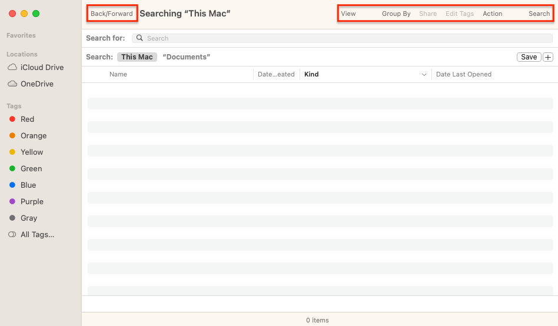
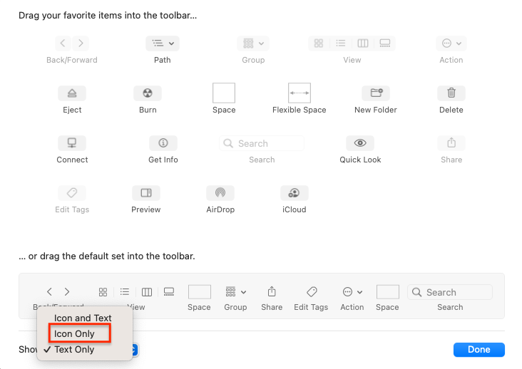
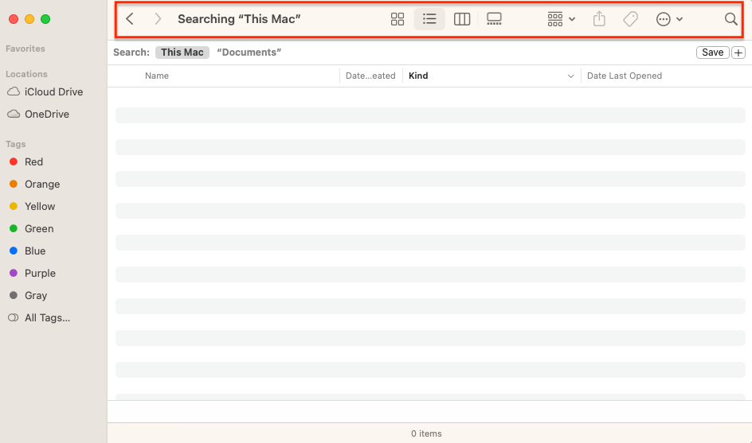

After upgrading to Sonoma 14 I noticed the icons in the Finder window had been replaced by text.

To change this back to how it used to be, go to **View** > **Customize Toolbar** and select **Icon Only** (or **Icon and Text** if you prefer).

That's better!

