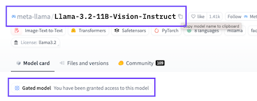
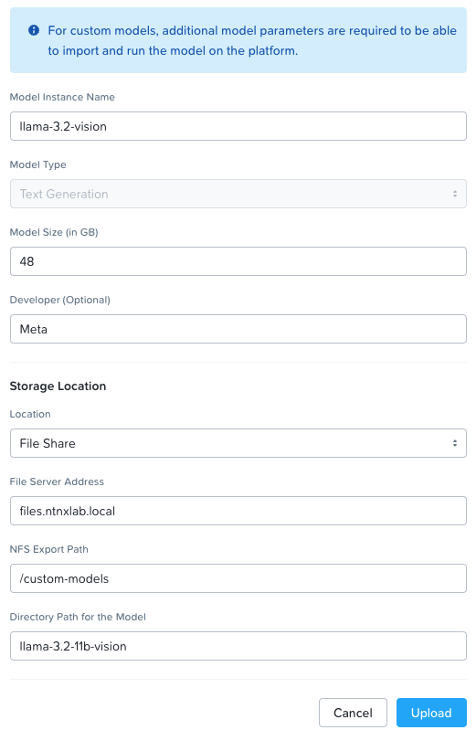

Cheat sheet for importing a custom model into Nutanix Enterprise AI. 

### Step 1. Mount file share

On your workstation, mount your file share. Ensure that Nutanix Enterprise AI also has connectivity to this share.


```
mkdir /mnt/custom-models
mount files.ntnxlab.local:/custom-models /mnt/custom-models
```

### Step 2. Install huggingface-cli

[HuggingFace documentation](https://huggingface.co/docs/huggingface_hub/main/en/guides/cli)

```
pip install -U "huggingface_hub[cli]"
```

### Step 3. Find the model you want on HuggingFace

Find the model you want on HuggingFace. Make sure you have been granted access to the model



### Step 4. Download the model

```
huggingface-cli download --local-dir /mnt/custom-models/llama-3.2-11b-vision meta-llama/Llama-3.2-11B-Vision-Instruct
```

### Step 5. See what the model size is

We'll need to specify the model size when importing into Nutanix Enterprise AI
```
[nutanix@localhost llama-3.2-11b-vision]$ du . -sh
40G	.
```

### Step 6. Import the model in Nutanix Enterprise AI




For what to do next (creating and testing an endpoint), check out this <a href="https://www.linkedin.com/pulse/experimenting-vision-models-nutanix-enterprise-ai-laura-jordana-mreec/?trackingId=F%2FWD3eeJOLqKzXu4uN7MGw%3D%3D" target="_blank">LinkedIn post</a>.