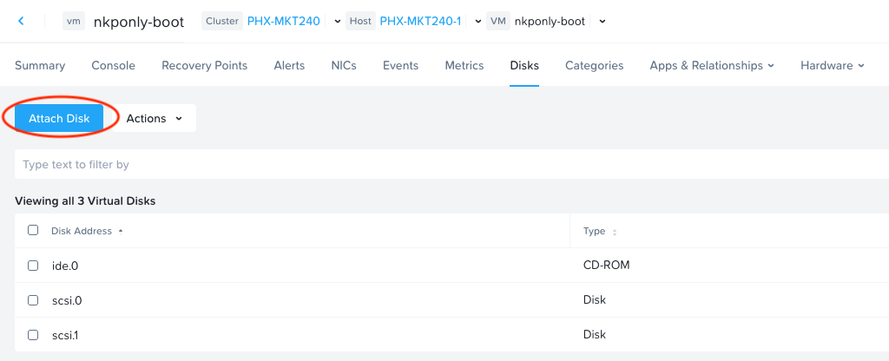

1. Attach additional SCSI Disk in Prism Central

    In PC 7.3.0.5, you can do this by clicking the VM, clicking on Disks, then clicking Attach Disk

    

2. SSH to the machine

3. Identify the new device with `fdisk`

    ```
    $ sudo fdisk -l
    Disk /dev/sda: 20 GiB, 21474836480 bytes, 41943040 sectors
    Disk model: VDISK
    Units: sectors of 1 * 512 = 512 bytes
    Sector size (logical/physical): 512 bytes / 4096 bytes
    I/O size (minimum/optimal): 4096 bytes / 1048576 bytes
    Disklabel type: gpt
    Disk identifier: 6FDF149D-8A50-4199-A996-E4543FED36CD

    Device       Start      End  Sectors  Size Type
    /dev/sda1     2048   204799   202752   99M EFI System
    /dev/sda2   204800  2252799  2048000 1000M Linux filesystem
    /dev/sda3  2252800  2260991     8192    4M PowerPC PReP boot
    /dev/sda4  2260992  2263039     2048    1M BIOS boot
    /dev/sda5  2265088 41943006 39677919 18.9G Linux filesystem


    Disk /dev/sdb: 100 GiB, 107374182400 bytes, 209715200 sectors
    Disk model: VDISK
    Units: sectors of 1 * 512 = 512 bytes
    Sector size (logical/physical): 512 bytes / 4096 bytes
    I/O size (minimum/optimal): 4096 bytes / 1048576 bytes
    ```

    In this case it's `/dev/sdb`

4. Run `parted` to see the disk size in GB (not GiB)

    `sudo parted -l`

    Example output:

    ```
    Error: /dev/sdb: unrecognised disk label
    Model: NUTANIX VDISK (scsi)
    Disk /dev/sdb: 107GB
    Sector size (logical/physical): 512B/4096B
    Partition Table: unknown
    Disk Flags:
    ```

    Size is 107GB

5. Run `parted` in interactive mode

    `sudo parted`

6. Within parted, select the disk

    `(parted) select /dev/sdb`

7. Make the partition label

    `(parted) mklabel gpt`

8. Create the partition

    `(parted) mkpart primary ext4 1MB 107GB`

9.  Exit parted

    `(parted) quit`

10. Create the filesystem

    `sudo mkfs -t ext4 /dev/sdb`

11. create a directory and mount the filesystem

    ```
    sudo mkdir /mnt/new
    sudo mount /dev/sdb /mnt/new
    ```