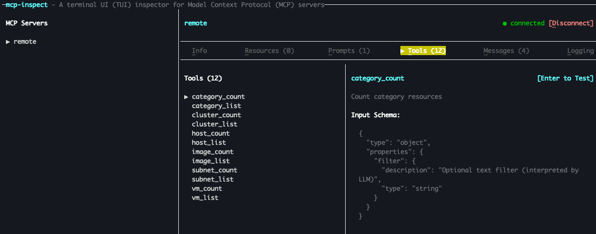

Documenting my experience following this [post](https://nai.howntnx.win/nkp_tutorials/nkp_mcp_lab/nkp_nai_mcp) to deploy an experimental Prism MCP Server on NKP.

## Versions used
* NKP v2.16.1
* Toolhive v0.8.3

## Prep environment variables
```
export REGISTRY_URL=https://registry.example.org/mcp
export REGISTRY_HOST=registry.example.org
export REGISTRY_USERNAME=admin
export REGISTRY_PASSWORD=your_registry_password
export REGISTRY_CACERT=path_to_ca_cert_of_registry # if needed
export NUTANIX_USERNAME=admin
export NUTANIX_PASSWORD=your_nutanix_password
export NUTANIX_ENDPOINT=pc.example.com # or IP address
```

## Deploy Toolhive Operator

[Toolhive](https://docs.stacklok.com/toolhive) provides orchestration and policy for MCP tools. It can:

* Run MCP servers
* Expose them safely to LLMs / clients
* Control who can call which tools
* Handle networking, auth, TLS, scaling, and lifecycle

### Install THV binary

From the [docs](https://docs.stacklok.com/toolhive/guides-cli/):

```The ToolHive CLI (thv) is a command-line tool that allows you to deploy and manage MCP servers on your local machine or in development environments.  ```

In my set up I'm installing it on my Rocky Linux jumphost used to manage my Kubernetes clusters. I decided to install the latest version found on [Github](https://github.com/stacklok/toolhive/releases). As of the time of this writing this was v0.8.3.

```
mkdir $HOME/mcp
cd $HOME/mcp
curl -LO https://github.com/stacklok/toolhive/releases/download/v0.8.3/toolhive_0.8.3_linux_amd64.tar.gz
tar -xzf toolhive_0.8.3_linux_amd64.tar.gz
sudo mv thv /usr/local/bin/
sudo chmod +x /usr/local/bin/thv
```

Note that `curl -L` is needed to handle the HTTP redirection that GitHub is using. `curl -O` saves the file using its original name from the server.

### Verify THV binary

```
thv version
```

This should return something like:

```
ToolHive v0.8.3
Commit: a95c82a8a86d2ac6f56d874bb0210f8aad7c3251
Built: 2026-01-29 18:51:19 UTC
Go version: go1.25.6
Platform: linux/amd64
```

## Prepare MCP Server Image

Next, we'll use the Toolhive CLI to build a containerized MCP server image directly from the source code repository.

### Build Dockerfile
First, we'll build a Dockerfile that will be used to create the image.
```
thv build --tag mcp-nutanix:latest go://github.com/thunderboltsid/mcp-nutanix@latest -o Dockerfile
```
### Create the Docker image
Then, we'll create the image. Note that go:// is a Toolhive-specific URI scheme, which provides unique instructions for the Toolhive CLI to define how to handle the source code. In this case it tells Toolhive which build environment to use (in this case Go)

```
thv build --tag mcp-nutanix:latest go://.
```

### Validate image

Next, we'll validate that image architecture matches linux/amd64
```
docker image inspect mcp-nutanix:latest --format '{{.Architecture}}{{.Os}}'
```

## Upload image to private container registry

First, create a project called mcp in Harbor registry

Then, run the following to tag and push the image:

```
source ~/.env
docker login ${REGISTRY_HOST} -u ${REGISTRY_USERNAME} -p ${REGISTRY_PASSWORD}
docker tag mcp-nutanix:latest ${REGISTRY_HOST}/mcp/mcp-nutanix:latest
docker push ${REGISTRY_HOST}/mcp/mcp-nutanix:latest
```

## Install MCP Server

### Validate Kubernetes connectivity

Make sure you are connected to the correct K8s cluster

Example commands:
```
kubectl cluster-info
kubectl config current-context
```

If not, update KUBECONFIG variable with the right config file.

```
export KUBECONFIG=/path/to/kubeconfig
```

### Install the Toolhive CRDs

This registers the new object types (e.g. MCPServer, Tool) with the Kubernetes API

```
helm upgrade -i toolhive-operator-crds \
oci://ghcr.io/stacklok/toolhive/toolhive-operator-crds
```

### Install the Toolhive operator

```
helm upgrade -i toolhive-operator \
oci://ghcr.io/stacklok/toolhive/toolhive-operator \
-n toolhive-system --create-namespace
```

### Verify Toolhive Installation

At this point you should see the toolhive-operator pod running in the toolhive-system namespace:

If you have kubens installed
```
kubens toolhive-system
kubectl get pods
```

It should look something like this
```
NAME                                 READY   STATUS    RESTARTS   AGE
toolhive-operator-5bcb8dbfd4-2zmzw   1/1     Running   0          53s
```

### Create registry secret
```
kubectl create secret docker-registry regcred \
--docker-server=${REGISTRY_HOST} \
--docker-username=${REGISTRY_USERNAME} \
--docker-password=${REGISTRY_PASSWORD} \
-n toolhive-system
```

### Deploy MCP Server
```
cat <<EOF | kubectl apply -f -
apiVersion: toolhive.stacklok.dev/v1alpha1
kind: MCPServer
metadata:
  name: nutanix
  namespace: toolhive-system
spec:
  image: ${REGISTRY_HOST}/mcp-nutanix:latest
  transport: stdio
  port: 8080
  permissionProfile:
    type: builtin
    name: network
  env:
  - name: NUTANIX_ENDPOINT
    value: "${NUTANIX_ENDPOINT}"
  - name: NUTANIX_USERNAME
    value: "${NUTANIX_USERNAME}"
  - name: NUTANIX_PASSWORD
    value: "${NUTANIX_PASSWORD}"
  - name: NUTANIX_INSECURE
    value: "true"
  podTemplateSpec:
    spec:
      imagePullSecrets:
      - name: regcred
      containers:
        - name: mcp
          resources:
            limits:
              cpu: "500m"
              memory: "512Mi"
            requests:
              cpu: "100m"
              memory: "128Mi"
  resources:
    limits:
      cpu: "100m"
      memory: "128Mi"
    requests:
      cpu: "50m"
      memory: "64Mi"
EOF
```

### Check the health

```
kubectl get mcpserver
```

It should be in a running state

```
NAME      STATUS    URL                                                               AGE
nutanix   Running   http://mcp-nutanix-proxy.toolhive-system.svc.cluster.local:8080   78s
```

You should also see two "nutanix" pods running.

```
[nutanix@nkp-boot ~]$ k get pods
NAME                               READY   STATUS    RESTARTS   AGE
nutanix-0                          1/1     Running   0          1m
nutanix-5c58dd9f7c-phgpb           1/1     Running   0          1m
toolhive-operator-c6f6f5dd-84dmd   1/1     Running   0          2m
```

`nutanix-0` is the stateful pod which contains the actual MCP server.
THe other one (in this example `nutanix-5c58dd9f7c-phgpb`) is the sidecar-style proxy pod created automatically by the operator. It receives the incoming network requests and translates them into `stdio` commands that the MCP server understands.

## Expose MCP Server for External Access

We'll use the pre-deployed Traefik ingress that comes with NKP

### Create secret called mcp-cert with certificate for our domain

kubectl create secret tls mcp-cert --cert=/path/to/cert --key=/path/to/key --dry-run=client -o yaml | kubectl apply -f -

### Get the IP for the Traefik ingress
```
export INGRESS_IP=$(kubectl get ingress kommander-kommander-ui -n kommander -o jsonpath='{.status.loadBalancer.ingress[0].ip}')

# Set hostname to whatever your FQDN needs to be
export MCP_HOSTNAME=mcp-nutanix-${INGRESS_IP//./-}.sslip.nutanixdemo.com
```

### Apply the ingress config
```
kubectl apply -f -<<EOF
apiVersion: networking.k8s.io/v1
kind: Ingress
metadata:
  name: mcp-nutanix-proxy-ingress
  namespace: toolhive-system
  annotations:
    kubernetes.io/ingress.class: kommander-traefik
    traefik.ingress.kubernetes.io/router.tls: "false"
spec:
  rules:
  - host: $MCP_HOSTNAME
    http:
      paths:
      - backend:
          service:
            name: mcp-nutanix-proxy
            port:
              number: 8080
        path: /
        pathType: Prefix
  tls:
  - hosts:
    - $MCP_HOSTNAME
    secretName: mcp-cert
EOF
```
### Check the health of the MCPServer resource
```
curl https://$MCP_HOSTNAME/health
```

### Optional - Execute mcp-remote and mcp-inspect npm modules for testing

In one terminal, run the following to start the server
```
$ npx -y mcp-remote https://$MCP_HOSTNAME/mcp
[3395582] Using automatically selected callback port: 14045
[3395582] Discovering OAuth server configuration...
[3395582] [3395582] Connecting to remote server: https://mcp-server-10-54-90-16.sslip.nutanixdemo.com/mcp
[3395582] Using transport strategy: http-first
[3395582] Connected to remote server using StreamableHTTPClientTransport
[3395582] Local STDIO server running
[3395582] Proxy established successfully between local STDIO and remote StreamableHTTPClientTransport
[3395582] Press Ctrl+C to exit
```

In another terminal, create a config.json file that looks like this

```
{
  "mcpServers": {
    "remote": {
      "command": "npx",
      "args": [
        "-y",
        "mcp-remote",
        "https://$MCP_HOSTNAME"
      ]
    }
  }
}
```

Then start the mcp-inspect tool

```
$ npx -y mcp-inspect config.json
```

Inside the mcp-inspect tool, press `C` to connect



Use the tab + arrow keys to navigate.

### Lightweight MCP Client to list tools from MCP Server

Or you can run a [script](https://raw.githubusercontent.com/lauramariel/nai/refs/heads/main/mcp/mcp_client.py) to list all the tools from the MCP server.

```
# Download script
wget https://raw.githubusercontent.com/lauramariel/nai/refs/heads/main/mcp/mcp_client.py

# Update script with your hostname
sed -i "s/mcp-server.example.org/$MCP_HOSTNAME/g" mcp_client.py

# Run the script
python3 mcp_client.py
```

The output should look similar to this

```
=== Available Tools ===

Tool: category_count
Description: Count category resources
Input schema:
{
  "properties": {
    "filter": {
      "description": "Optional text filter (interpreted by LLM)",
      "type": "string"
    }
  },
  "type": "object"
}
----------------------------------------
Tool: category_list
Description: List category resources
Input schema:
{
  "properties": {
    "filter": {
      "description": "Optional text filter (interpreted by LLM)",
      "type": "string"
    }
  },
  "type": "object"
}
```

... and so on